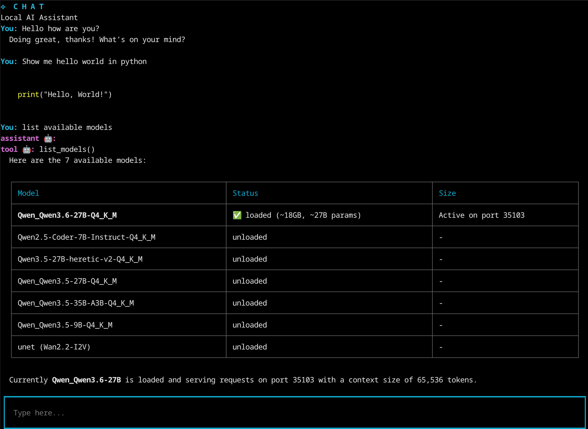

### Local-first coding assistant



## Overview

Cordite is a plugin-based AI assistant server that communicates with multiple client types (Terminal, Discord, IRC) through a unified message queue system. The server processes user queries through an LLM and executes tool calls via skills.

**Key Features:**
- Multi-platform support (Terminal, Discord, IRC)
- Plugin-based skill system for extensibility
- Conversation memory with vector search capabilities
- Async message queue architecture
- **One-click setup** - Everything automates for you! 🚀

## Quick Start (One-Click Install)

```bash
# Clone the repository
git clone https://github.com/your-repo/corditecode.git
cd corditecode

# Run the one-click setup script
./setup.sh

# Start the terminal coding agent in a safe container (no files, you will need to git clone)
./corditecode

# Alternatively, to run very unsafe (will have fill permissions of your current user)
# python main.py terminal
```

That's it! The `setup.sh` script will:
1. ✅ Check for Python and create a virtual environment
2. ✅ Install all dependencies automatically
3. ✅ Build llama.cpp from source (with CUDA support if available)
4. ✅ Download a default model (Qwen3.5-27B-Q4_K_M)

## Running

### Prerequisites

The setup script handles most prerequisites, but you should have:
- Python 3.x installed
- Git installed
- (Optional) NVIDIA GPU with CUDA for faster inference

### Option 1: Podman Container (requires podman or docker)

This is a quick terminal way to run:

```bash
# WARNING: Uses host network (insecure but more secure than filesystem access)
./corditecode
```

This has no files so you want to pull in a project using git perhaps first. The conversation history / session is stored locally in ./conversations

### Option 2: Local Python Environment (After Setup) (Dangerous)

```bash
# Run the terminal UI (alteratively use discord_client or irc_client)
python main.py terminal
```

## Configuration

See `config.json` for available options:

- `"terminal"` - Local terminal interface
- `"discord_client"` - Discord integration (requires API key in `.env` and a Discord APP)
- `"irc_client"` - IRC integration (requires code edits for server credentials)

### Environment Variables

The system uses a dotenv priority system:
1. **Hardcoded defaults** - Fallback values if no env files exist
2. **`.env.defaults`** - Template with sensible defaults (loaded automatically)
3. **`.env`** - Your custom overrides (if present, takes precedence)

## Available Commands

See Functions.md

## High-Level Components

### Core Server (`server.py`)

The central hub that orchestrates communication between clients and the LLM.

**Responsibilities:**
- Manages HTTP transport to llama-server
- Handles conversation state (message history)
- Processes tool calls and executes skills
- Routes queries and responses through queues
- Loads and registers skill tools dynamically

**Key Data Structures:**
- `queries`: AsyncQueue - Incoming user messages from clients
- `responses`: AsyncQueue - Outgoing chat tokens/results to clients
- `messages`: List[Message] - Conversation history (persists across calls)

**Main Flow:**
```
Client → queue_query() → queries queue → server.py → handle_message() 
→ stream_chat_completion() → consume_stream() → execute_tool_calls()
→ responses queue → client
```

### Client Plugins

Three client implementations that follow the same interface pattern:

#### Terminal (`terminal.py`)
- Single-user interface (local terminal)
- Direct stdin/stdout interaction
- No user tracking needed (only one user)

#### Discord (`discord_client.py`)
- Multi-user chat interface
- Requires Discord API credentials

#### IRC (`irc_client.py`)
- Multi-user chat interface
- Handles private messages from multiple nicks

##### Client API

Each client has the following API provided to it:

```python
async def queue_query(query: str) -> None:
    global queries
    await queries.put(query)

async def get_response() -> Tuple[str, str, bool]:
    return await responses.get()
```

### Skill System

Skills are located in the `skills/` directory as `.md` files. Each file defines a tool with name, description, and parameters. Skills are auto-loaded at runtime via `load_skills()`. They can just be free-form. They are reloaded every chat cycle as well, so you can use it for anything.

**Built-in Skills (experimental, don't work well):**
- `curl_skill` - Fetches webpage URLs
- `mux_skill` - Starts long-running commands in background tmux sessions

## File Structure

```
.
├── main.py              # Entry point
├── main_types.py        # Type definitions
├── server.py            # Core message handling
├── conversation.py      # Conversation management
├── tools.py             # Tool definitions and skill loading
├── vector_search.py     # Conversation search
├── config.json          # Configuration
├── requirements.txt     # Python dependencies
├── setup.sh            # One-click setup script
├── build_llama.py      # llama.cpp build script
├── download_model.py   # Model download utility
├── start_llama.sh      # Script to start llama-server
├── podman-compose.yaml # Container orchestration
├── .env                # Environment variables (custom)
├── .env.defaults        # Environment defaults
├── Dockerfile          # Container build config
├── clients/            # Client implementations
│   ├── __init__.py
│   ├── terminal.py     # Terminal client
│   ├── discord_client.py # Discord integration
│   └── irc_client.py   # IRC integration
├── skills/             # Skill definitions (.md files)
│   ├── curl.md         # URL fetching skill
│   └── mux.md          # Background task skill
├── conversations/      # Stored conversation history (.txt and .json files)
├── llama.cpp/          # llama.cpp source (built during setup)
└── opencode/           # opencode source (built during setup)
```

## Extending

### Adding New Skills

1. Create a `.md` file in `skills/` directory
2. Define tool name, description, and parameters using function-calling format, or use any freeform text

### Adding New Clients

Implement the client interface with:
- `queue_query(query)` - Send messages to server
- `get_response()` - Receive responses from server
- Platform-specific connection handling

## License

MIT License
